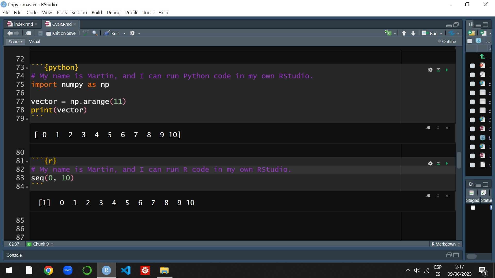

# Tools and data science

This section explains why the course uses data science tools, how R and Python fit into business, economics, and finance education, what role AI assistants may play, and which coding and publishing environments students are expected to understand.

## Data science and quantitative analysis. `r fontawesome::fa("database")`

Data science is the study of extracting generalizable knowledge from data. It requires an integrated skill set that combines operations research, statistics, computer science, and domain-specific expertise. In this course, students are introduced to the basic principles, tools, and mindset of data science within a business, economics, and finance context. This includes data collection and integration, exploratory data analysis, descriptive and predictive modeling, visualization, evaluation, and effective communication. For a comprehensive introduction to the application of data science in finance, see @hull2020machine.

This podcast, broadcast in December 2023, provides additional context on my view of this topic.

```{=html}
<div class="video-embed">
  <iframe src="https://www.youtube-nocookie.com/embed/SKG3Kr-TK-w" title="YouTube video" allow="accelerometer; autoplay; clipboard-write; encrypted-media; gyroscope; picture-in-picture; web-share" allowfullscreen></iframe>
</div>
```


The goal of this course is not to turn students into data scientists. Rather, the goal is to build a foundation for future specialization, including postgraduate study or professional training. Many undergraduate students now recognize the need for basic knowledge in data science and machine learning because these areas increasingly shape job opportunities. In the past, computer literacy was essential for executives. Today, business professionals are also expected to be comfortable working with large data sets and collaborating with data science specialists to drive innovation and productivity.

Learning these computational skills is aligned with the development of STEAM skills: Science, Technology, Engineering, Arts, and Mathematics. For more information on STEAM skills, see @boon2019exploring. In my opinion, undergraduate business education should include authentic tasks grounded in real-world business contexts. These tasks often involve ill-defined problems, complex or multi-step questions, multiple approaches to problem-solving, and sub-tasks that integrate knowledge across disciplines. This course incorporates some of these STEAM principles into several learning activities.

Data science has a strong connection with finance and economics. In this course, students will also encounter data science concepts and tools in relation to *digital humanities*. Digital humanities is an interdisciplinary field that includes research, teaching, and innovation at the intersection of computing and disciplines such as economics and finance. It studies the investigation, analysis, synthesis, and presentation of information in electronic form, as well as the impact of digital media on the disciplines that use them. This matters for business, economics, and finance because modern analysis increasingly involves reports, regulation, news, textual data, institutional documents, and other forms of digital information. For a deeper discussion of digital humanities, see @klein2019debates. For data science and data ethics informed by the principles of intersectional feminism, which aligns with the fifth [United Nations Sustainable Development Goal](https://sdgs.un.org/goals) on gender equality, see @d2020data.

The following video introduces the 17 [United Nations Sustainable Development Goals](https://sdgs.un.org/goals):

```{=html}
<div class="video-embed">
  <iframe src="https://www.youtube-nocookie.com/embed/5G0ndS3uRdo" title="YouTube video" allow="accelerometer; autoplay; clipboard-write; encrypted-media; gyroscope; picture-in-picture; web-share" allowfullscreen></iframe>
</div>
```

## R and Python. `r fontawesome::fa("r-project")` `r fontawesome::fa("plus")` `r fontawesome::fa("python")`

R is a programming language and free software environment designed for statistical computing and graphics. It is supported by the [R Foundation for Statistical Computing](https://www.r-project.org/foundation/) and widely used for statistical software, data analysis, visualization, and reproducible research. Python is an interpreted, interactive, and object-oriented programming language. It supports modules, exceptions, dynamic typing, high-level data structures, and multiple programming paradigms, including procedural and functional programming.

```{=html}
<div class="video-embed">
  <iframe src="https://www.youtube-nocookie.com/embed/9kYUGMg_14s" title="YouTube video" allow="accelerometer; autoplay; clipboard-write; encrypted-media; gyroscope; picture-in-picture; web-share" allowfullscreen></iframe>
</div>
```

Getting started with R and Python has become increasingly accessible because of the abundance of free resources available online. This now includes artificial intelligence (AI) tools and specialized AI programming assistants. Learning these languages still requires time, practice, and effort. However, the perceived difficulty of programming is often a major barrier only at the beginning; once students start practicing consistently, progress usually becomes more natural.

Learning to program in 2026 is not the same as learning to program several years ago. The objective is no longer to memorize syntax, remember the structure of every function, or write every line of code without assistance. Even experienced programmers now use documentation, examples, search engines, coding assistants, and AI-supported workflows to generate, revise, test, and improve code. Students still need enough conceptual fluency to read code, understand basic structures, recognize errors, and make informed decisions. In this course, learning to code means learning how to formulate a problem, guide the assistant, inspect the proposed code, test it, adapt it to the data and methods of the course, interpret the output, and explain the full process clearly.

This course integrates data science, data analysis, and computational modeling using R, @Rcitation, and Python as the primary tools. Students will have the opportunity to learn or further develop coding skills that make it possible to apply economic, financial, and quantitative models in practical settings. The course is not primarily a computer science course, and there is limited time to cover the mandatory course material. For this reason, students are expected to engage in hands-on assignments, collaborate with peers, use specialized AI tools appropriately, and use online resources such as [DataCamp](https://www.datacamp.com/) courses to learn R and Python.

```{=html}
<div class="video-embed">
  <iframe src="https://www.youtube-nocookie.com/embed/4lcwTGA7MZw" title="YouTube video" allow="accelerometer; autoplay; clipboard-write; encrypted-media; gyroscope; picture-in-picture; web-share" allowfullscreen></iframe>
</div>
```


There are several approaches to learning basic data science and developing the ability to transform information into valuable business intelligence. Learning to code is one approach that I strongly recommend. Coding helps students think more systematically, break complex problems into smaller steps, and generate reproducible solutions. In business, economics, and finance job markets, there is growing demand for candidates with knowledge of data science and computational modeling because these skills support creative problem-solving and rigorous data analysis.

The following Steve Jobs video illustrates why learning to code can matter beyond programming itself:

```{=html}
<div class="video-embed">
  <iframe src="https://www.youtube-nocookie.com/embed/BRTOlPdyPYU" title="YouTube video" allow="accelerometer; autoplay; clipboard-write; encrypted-media; gyroscope; picture-in-picture; web-share" allowfullscreen></iframe>
</div>
```

Learning programming may seem challenging and frustrating at first. Students should know that it is usually less difficult than it initially appears, especially when practice is consistent. Learning R and Python gives students access to free and open-source software supported by generous online communities. These communities provide examples, documentation, tutorials, and guidance that can make the learning process easier. Students will also discover the advances in scientific document production that come with these tools, which offer possibilities that are difficult to reproduce with traditional commercial software.

For university students who are new to programming, AI-based assistants for R and Python coding can significantly improve productivity and support learning. AI assistants can provide real-time code suggestions, autocomplete features, and immediate feedback, helping beginners write code more efficiently and with fewer errors. These tools can also guide students toward good practices, help identify mistakes, and support debugging. When used carefully, they can help students understand coding principles and move more smoothly from basic learning to applied work. In practice, students should expect to use assistants when writing code, but they should also expect to be evaluated on whether they understand the code, the methodology, the results, and the limitations of what they submit.

However, there are also drawbacks. The problem is not using AI assistance; the problem is submitting code that students cannot inspect, explain, modify, or defend. AI suggestions are not always accurate or appropriate for the specific context of a course activity. Inexperienced programmers may also struggle to decide which recommendations to follow. AI tools tend to be more useful when users already have enough programming knowledge to evaluate the suggestions. For this reason, students should combine AI assistance with traditional learning methods, practice, reading, testing, and independent reasoning.

## `r fontawesome::fa("burst")` Generative AI tools and virtual assistants

The use of generative AI tools and virtual assistants in course activities is explicitly allowed, subject to the specific instructions, academic integrity standards, and group-work rules of each activity. This policy applies broadly to current and future AI systems, including but not limited to conversational assistants, coding assistants, AI-powered search tools, writing assistants, data-analysis assistants, and tools integrated into browsers, office software, IDEs, learning platforms, or other applications.

This wording is intentionally tool-agnostic. ChatGPT is only one example among many available tools, and the course does not assume that any single platform is the best, the only relevant option, or the one students must use. The AI landscape changes rapidly, and students are expected to develop judgment that transfers across tools rather than dependence on one specific brand or interface.

The mechanics of this course intentionally allow students to use these tools when preparing electronic deliverables for homework assignments and exams. This includes using AI to explore alternatives, improve code, debug errors, strengthen written explanations, and communicate results more effectively. The purpose is not to reduce intellectual effort, but to raise the quality and scope of what students can attempt while learning the course topics, data analysis, and computational modeling.

This policy is directly connected to the assessment design of the course. Homework assignments and exams include electronic report submissions in which AI use is allowed, and they also include complementary activities in which students present, explain, and discuss their results orally in class. These complementary oral activities carry more weight than the electronic submission of homework and exam reports. This creates a deliberate balance: students can use modern tools to build stronger and more ambitious work, while their understanding is verified through clear communication, technical explanation, professional reasoning, and the ability to explain the methodology, code, results, and limitations of the submitted work.

However, permission to use these tools does not mean they should be used indiscriminately or without judgment. These tools can make mistakes, especially when a task depends on a specific data set, conditions stated in the course materials, or methodologies and procedures taught in class. They may create the false impression that they can solve course questions and activities infallibly, but that is not the case.

Students must also use external platforms responsibly. They should not upload, disclose, or share confidential, private, sensitive, proprietary, or unauthorized information with AI tools or third-party platforms. This includes personal data, private communications, credentials, classmates' work, non-public data sets, institutional information, or any material that the course has not authorized for external sharing. When needed, students should anonymize data, remove identifying information, or ask for guidance before using an external tool. Routine use of AI tools does not need to be declared unless a specific activity explicitly requires it.

These tools can be useful for studying, learning, reviewing code, improving drafts, exploring alternatives, debugging errors, and strengthening projects or assignments. Students are also encouraged to use AI tools, course materials, available sources, and meetings or advising sessions with me to understand their work more deeply and prepare clearer presentations. The key standard is not whether AI was used extensively, but whether students understand the work well enough to verify it, adapt it to the course requirements, explain it correctly, and defend the reasoning behind it. When students rely on AI-generated answers without understanding, verification, or adaptation, that weakness will most likely be reflected in the quality of their work, their oral explanations, and their grades.

## `r fontawesome::fa("lock")` Commercial alternatives and reproducibility

Throughout their undergraduate studies, students will be expected to acquire proficiency in various commercial software programs, such as Microsoft Excel, SPSS, Stata, EViews, and many others. I strongly encourage students to develop skills in these programs, particularly when their use is required by another professor or by a professional context. However, students should also recognize that these programs are owned by private firms and are primarily designed within commercial ecosystems. There is no guarantee that their file formats, interfaces, or licensing conditions will remain stable or accessible in the future, which can affect reproducibility.

I will never discourage students from learning commercial software. At the same time, this course emphasizes the alternative of learning user-oriented programming languages, such as R and Python, for rigorous data analysis in business, economics, and finance. These languages are supported and continuously improved by large scientific communities, which also provide extensive online resources for beginners.

Commercial software products are important in the job market. However, many of them rely heavily on point-and-click interaction through predefined menus. This interaction is often temporary and unrecorded, which means that many choices made during a quantitative analysis may remain undocumented. This creates problems because it becomes difficult to trace, replicate, audit, or extend the analysis in a different context. In contrast, coding helps produce reproducible research. Learning to code is similar to writing a recipe: once the steps are recorded, the process can be executed again, checked, modified, and shared.

Commercial software products may also involve high licensing fees and opaque "black boxes", that is, systems or processes whose internal workings are hidden or difficult to inspect. These black boxes can provide little insight into the assumptions and procedures used to produce the final results. Users may be left with the false impression that they can perform data analysis without fully understanding the process. While this convenience may be useful in specific situations, it can limit the exploration, customization, and transparency required for innovative applications.

In contrast, languages such as R and Python provide a versatile alternative to point-and-click programs. With these languages, students can write scripts for business, economic, and financial analysis, visualization, simulation, and reporting. By working directly with the details of the computation, students gain a deeper understanding of the process and unlock possibilities for customization and innovation.

For this reason, students are encouraged to embrace the shift from clicking to scripting. The following video illustrates this idea:

```{=html}
<div class="video-embed">
  <iframe src="https://www.youtube-nocookie.com/embed/hb7Q33ysCwI" title="YouTube video" allow="accelerometer; autoplay; clipboard-write; encrypted-media; gyroscope; picture-in-picture; web-share" allowfullscreen></iframe>
</div>
```

While chefs may need to invest in ovens, kitchen equipment, and ingredients, many inputs in economics and finance, such as data and technology, are freely available. R and Python are open-source tools and can be used at no cost. By acquiring coding skills, students gain the ability to share, expand, reproduce, and innovate. These skills can help generate original empirical results for research outputs, dissertations, and professional projects.

## `r fontawesome::fa("cloud")` Cloud coding environments

A cloud coding environment is an online platform that provides tools for writing, editing, debugging, and running code directly within a web browser. Unlike traditional desktop IDEs, cloud environments require little or no local installation and can be accessed from different devices with internet connectivity. These platforms often support multiple programming languages and include features such as syntax highlighting, code completion, collaboration, version control integration, and AI assistance.

Examples of cloud coding environments include:

[Deepnote](https://deepnote.com/) is a cloud-based data notebook compatible with [Jupyter](https://jupyter.org/). It allows users to work on data science projects in real time and in one centralized location with colleagues.

[Google Colab](https://colab.google/), short for Google Colaboratory, is a free cloud-based platform that allows users to write, run, and share Python code within a Jupyter notebook environment. It is particularly popular for data science, machine learning, and deep learning tasks because it provides access to computing resources, including GPUs and TPUs, without requiring local setup. Users can work with data from several sources, integrate with Google Drive, and use many Python libraries. Colab is widely used in educational and research settings for prototyping, experimentation, and collaborative projects.

DataLab from [DataCamp](https://www.datacamp.com/) is an interactive coding environment designed for learning and practicing data science and analytics skills. It is part of DataCamp's educational platform and gives users tools for working with data. In DataLab, users can write and execute code in Python, R, and SQL, with access to common data science libraries and frameworks. The environment is integrated with DataCamp courses, allowing learners to apply knowledge through hands-on exercises and projects. DataLab also includes real-time collaboration and integrated AI assistance for feedback, code suggestions, and debugging support.

In this course, students will be asked to complete graded activities in DataLab. If DataLab fails or is temporarily unavailable, students may use other web-based or desktop IDE alternatives.

I consider [DataCamp](https://www.datacamp.com/) a useful alternative for learning data science. Normally, individuals and firms must pay for this kind of training. A premium individual DataCamp account may cost approximately a few dozen U.S. dollars per month, which can add up to roughly a couple hundred U.S. dollars over a semester. However, students in this course currently receive individual access to DataCamp courses and resources, including DataCamp's DataLab, for the whole semester, as long as DataCamp continues to provide this access free of charge for my students. In exchange, DataCamp asks for a mention on social media. The resources and instructions are available in these [communication guidelines](https://docs.google.com/document/d/1Dv-L036CZWsZCmn9W5p0ikgetlc4GcT-NQ9Rp_HebE0/edit). If students cannot access the link, they should email me.

## `r fontawesome::fa("desktop")` Desktop IDE.

A desktop Integrated Development Environment (IDE) is a software application installed locally on a computer. It provides tools for software development, including code editing, debugging, testing, syntax highlighting, code completion, refactoring, and version control. Desktop IDEs are often optimized for performance and customization. Working with a cloud-based IDE instead of a desktop IDE is similar to working with Google Docs instead of Microsoft Word: both approaches are useful, but they differ in location, control, collaboration, privacy, and backup responsibilities.

Examples of desktop IDEs include:

[RStudio](https://posit.co/products/open-source/rstudio/) is an integrated development environment specifically designed for R, which is widely used for statistical computing, data analysis, and visualization. RStudio provides a source editor, syntax highlighting, code completion, smart indentation, an interactive console, debugging tools, plotting tools, and package management. It also includes support for version control systems such as Git, making it easier to manage and collaborate on projects. RStudio supports R Markdown, Shiny applications, interactive dashboards, and Quarto documents. It can also work with Python, which makes it a versatile platform for data science and analytical work.

The main difference between R and RStudio is that R is the programming language, while RStudio is the user-friendly environment used to work with R. Students need to download and install both R and RStudio. In practice, students will mainly use RStudio as the interface for writing and running R code, while R performs the calculations behind the scenes. RStudio is free and can integrate multiple programming languages, such as R and Python, within a single data science project. This feature is useful when collaborating with teams that use different programming languages.

In this course, students will be asked to complete graded activities, including homework assignments and exams, using cloud-based alternatives, specifically DataCamp's DataLab. However, students are also required to install RStudio on their own computer.

Students who have not yet installed the necessary programs should download R, Python, and RStudio from the following websites: <https://www.r-project.org/>, <https://www.python.org/downloads/>, and <https://posit.co/downloads/>, respectively. The reference list at the end of this document includes YouTube installation guides that explain the step-by-step process of downloading and installing these programs from scratch.

<!-- `r fontawesome::fa("egg")` Easter egg. I may need some volunteers to help other fellow students install RStudio and ensure that it can run both R and Python code on their own computers. These volunteers may need to familiarize themselves by reviewing YouTube tutorials on how to correctly install it on PC and Mac. Volunteers need to demonstrate that they have successfully assisted other students enrolled in this class in completing their installations. I will assign one sticker to each volunteer for every group of three students they provide help to. The evidence must be uploaded in the discussion forum (first partial) before our first partial exam. Here is a sample of valid evidence: -->

<!-- ```{r echo=FALSE, out.width="70%", fig.align="center"} -->
<!--  -->
<!-- ``` -->

There are other alternatives to RStudio, such as [Anaconda](https://www.anaconda.com/), Positron, and [Visual Studio Code](https://code.visualstudio.com/). My personal preference for this course is RStudio.

## `r fontawesome::fa("paper-plane")` Publishing platforms

Coding environments are used to create analyses; publishing platforms are used to communicate them. A modern data workflow often ends with a document, website, book, dashboard, app, slide deck, notebook, or manuscript that other people can read, inspect, reproduce, or discuss. Students should understand that writing code is only part of the professional workflow. Communicating results clearly is equally important.

[Quarto](https://quarto.org/) is a scientific and technical publishing system that can create reproducible documents, websites, books, presentations, dashboards, and reports from tools such as R, Python, Julia, and Observable. This syllabus is an example of a Quarto book rendered as a website and hosted through [GitHub Pages](https://pages.github.com/).

[Posit Connect Cloud](https://connect.posit.cloud/) is a cloud platform for publishing and sharing data applications and documents. It turns work into live, linkable outputs without requiring users to manage infrastructure. It supports content built with R and Python tools such as Shiny, Streamlit, Dash, and Bokeh, as well as documents created with Quarto, R Markdown, and Jupyter Notebooks. It can also connect to GitHub so updates can be redeployed as code changes.

[Prism](https://openai.com/prism/) is an AI-native LaTeX workspace from OpenAI for scientific writing and collaboration. It integrates drafting, collaboration, AI-assisted editing, proofreading, citation support, literature search, and LaTeX workflows in a single cloud-based environment. It is a useful example of how scientific writing platforms are evolving toward integrated AI-assisted research workflows.

[Overleaf](https://www.overleaf.com/) is a cloud-based platform for collaborative scientific writing with LaTeX. It is useful for academic manuscripts, technical documents, equations, bibliographies, and collaborative editing. Students may also encounter newer AI-assisted scientific writing and publishing tools during the semester. These tools can help with drafting, formatting, references, LaTeX, revision, and publication workflows, but they do not replace responsibility for accuracy, citation, interpretation, reproducibility, or oral explanation.


## `r fontawesome::fa("surprise")` Relevance.

Just a few years ago, economic agents with privileged access to information had a clear comparative advantage in business and decision-making. Today, information and data are widely accessible. As a result, competitive advantage depends less on having access to information and more on knowing how to transform information into knowledge, analysis, decisions, and value. Manipulating, analyzing, and communicating data has become an essential skill for business professionals.

Learning programming languages can create uncertainty and stress for some students. For this reason, I have gathered a large set of varied and free resources for learning R and Python in the reference section of this syllabus. Students have more resources than they can reasonably use during one semester, so the challenge is not scarcity but organization, persistence, and practice. Students will need to learn some things independently and investigate others on their own. This is intentional: in the job market, professionals must constantly learn, apply new knowledge, and solve problems that do not yet exist. A competitive graduate is not only someone who learns what was taught in class, but also someone who learns how to learn.

University is a time for learning and exploring new things. Learning languages such as R and Python is one part of that educational journey. Although it may require time and effort at the beginning, the benefits can far outweigh the initial investment. These skills can enhance students' academic experience and provide valuable tools for future professional work. Temporary frustration is common during the learning process, but students should not let it reduce their enthusiasm or limit their broader learning experience. Challenges are part of the process; seeking help when needed is also part of the process.

In my opinion, English is the predominant language for research and business. Mathematics and statistics are languages that help us understand uncertainty, structure, and relationships in the world. AI-assisted computational work allows us to communicate with computers, test ideas, conduct statistical experiments, analyze data, and produce reproducible outputs in business contexts. Because computers and AI systems are now central to professional life, students should learn to interact with them not only as users, but also as informed analysts who can guide, verify, and explain computational work. In business, economics, and finance, students can distinguish themselves by developing proficiency in three forms of interaction with the professional environment: English, mathematics and statistics, and AI-assisted computational work.

<!-- ## R markdown. -->

<!-- You may be quite familiar with using MS-Word to produce reports. The process is simple as you start with a MS-Word document and your final result is a MS-Word or perhaps a PDF document. However, taking a pdf file and converting it into a webpage or MS-Word document is not that easy as it requires a lot of editing. In fact, this is usually a painful and timely process. RStudio allow you to produce professional documents in a wide variety of types including finished web page, PDF, MS Word document, slide show, presentations, handout, book (see for example <https://otexts.com/fpp3/>), dashboard, package vignette, shiny applications (see for example <https://shiny.rstudio.com/gallery/>), scientific articles, academic thesis, among others. R markdown files have an rmd extension and this source file can be easily converted into a wide and growing different and convenient alternatives as listed above. -->

<!-- {width="100%"} -->

<!-- You will use RStudio not only to write your R code in this course, but also to produce (typesetting) the whole PDF assignment reports that you will submit. There is an online course in Datacamp called Reporting with R Markdown (Amy Peterson). If you have not taken it yet, I strongly recommend you to complete it as soon as possible. -->

<!-- A typical assignment report in my courses is a PDF document with a simple cover page, introduction (text), content (text, tables, figures, R code), conclusion (text), and references if applicable. In this course you will write the whole assignment report in RStudio, using the R Markdown package to produce the PDF final document. This is, knit a rmd file into a PDF. This task is not minor. For starters, this means that you will need to get familiar with \LaTeX, a high-quality typesetting system, to create your assignment reports. As an example, in \LaTeX you type: `$\displaystyle \sum_{n=1}^{\infty} \frac{1}{n}$` and the PDF output looks like this: -->

<!-- $\displaystyle \sum_{n=1}^{\infty} \frac{1}{n}$, or this $\sum_{n=1}^{\infty} \frac{1}{n}$. -->

<!-- \LaTeX is a computer programming language used for typesetting technical documents, and fortunately RStudio and R Markdown makes it easier to deal with \LaTeX. Learning how to use R Markdown to write formal reports is not an insignificant format issue; it is rather an opportunity to get to know and develop a new branch of skills that are very well aligned with the fourth industrial revolution and with the free data science technology. Eventually, you will learn that creating scientific documents that integrate code, output and analysis with R Markdown is easy if you use RStudio. See @xie2020r for a complete reference about R Markdown. -->

<!-- R Markdown requires you to download and install the full version of MiK\TeX  which is available here <https://miktex.org/download>. Please see <https://rmarkdown.rstudio.com/> and <https://rmarkdown.rstudio.com/authoring_quick_tour.html> for further details on this topic. -->

<!-- Installing the full version of MiK\TeX can be troublesome if you are not quite familiar with software installation. For this reason, Yihui Xie created a package in R that essentially does everything automatically: Tiny\TeX. I use MiK\TeX and I am not familiar with Tiny\TeX. However, it seems like a good alternative according to my students. I added a YouTube video that explains how to install Tiny\TeX in the reference list by the end of this syllabus. Most of my students use Tiny\TeX and they have had no issues at all. -->

<!-- It is common to get error messages when trying to produce an R Markdown PDF in RStudio, and people might find it hard to get the PDF done especially if this is their first time dealing with \LaTeX. In this respect, my best advice is to Google your question or the error message to find out the answer to your specific case. Fortunately, there is a very kind and growing community online that helps each other in a wide variety of data science topics at all levels of expertise. In my case, every time I have a question about programming, I find my answer online. I am not suggesting to Google the questions of your learning activities, but to Google how to deal with specific programming issues or specific error messages.  -->

<!-- ## \faGithub \hspace{1 mm} GitHub. -->

<!-- Git is a free and open source distributed version control system designed to handle everything from small to very large software projects with speed and efficiency. GitHub is the user-friendly interface of Git. Just as RStudio is a user-friendly interface of R. Therefore, you need to download and install Git (<https://git-scm.com/>) in order to sign up for a GitHub account. I use the web based client of GitHub, although others prefer the GitHub desktop version. I consider you will be OK with the web based client as well. -->

<!-- GitHub is a website and cloud-based service that helps developers store and manage their code, as well as track and control changes to their code and projects. GitHub is one of the world's largest communities of open source code developers. It fosters collaboration and communication between developers similar to a social network of coders. GitHub has a number of useful features that enable development teams to work together on the same project and easily track changes made by collaborators, and create new versions of software without disrupting the current versions. In this sense, GitHub is similar to Google Docs, but far, far more powerful and flexible. -->

<!-- I recommend you to use GitHub in your team in order to collaborate on your own homework assignments that require coding. My PEF students are required to use GitHub to collaborate on their project. -->

<!-- ## R, RStudio, R markdown, \LaTeX, Git, GitHub. -->

<!-- At this point you should be wondering how you are going to work with all these new software, languages and interfaces. First, you have to download and install the main base programs which are R and Git. There are some YouTube installation guides available at the end of this document, if you find better/newer videos please let me know to update this section. Second, you have to download and install RStudio and sign up for a free GitHub account. Third, you have to install the Tiny\TeX and the R markdown packages in RStudio so you can create your PDF assignment reports. You will work in your local computer using RStudio, and you will produce rmd files which will allow you to produce PDF documents. You will also have to collaborate so here comes the fourth step. Fourth, you have to learn how to integrate RStudio with GitHub. You have some nice YouTube videos to explain how to deal with this integration at the end of this document. This RStudio and GitHub integration will allow you to collaborate with others. Fifth, during all these steps you will need to take some DataCamp courses that can help you to learn how to code in R. In the course calendar you can see a list of courses that you will need to take in this course. -->

<!-- It is common that some students get familiar very quickly with these previous steps, especially with the installation steps. If you are one of those, I may need your help to assist other students that struggle with the download and installation process. If you are interested in helping me with this, please contact me and I can compensate for your extra work with stickers (see what they are later in this syllabus). Your job will be to help me with the questions I may receive throughout the semester. -->


